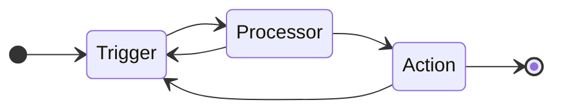

import { DiffOutlined, PlusOutlined, SelectOutlined } from "@ant-design/icons";

## Overview


&nbsp;

Agents can

- filter and process data
- upload files into Ganymede Cloud
- initiate data processing pipelines, based on:
  - files written to the local machine by the instrument
  - files written to a cloud storage bucket
  - a scheduled cadence
- deliver data from Ganymede Cloud to instrument PCs

Users specify these actions by configuring the Agent in the Ganymede app. Doing so creates a Linux binary and Windows executable, which can then be installed on instrument PCs. Optionally, users can [configure a user-defined Python script](#configuring-user-defined-python) associated with the Agent.

After creating an Agent, users can build and install local executables called Connections, individual instances of a given Agent, on instrument PCs. Each Connection consists of a combination of user-defined code and Ganymede configuration, providing flexibility in capturing files and interacting with the Ganymede ecosystem.

For system requirements, see [Agent Network Config & Prerequisites](../configuration/AgentSystemRequirements).

### Terminology

#### Agent structure

<div class="text--center">

</div>

- **Agent**: A combination of a trigger, processor, and action configuration to move data from a remote user device into Ganymede.
- **Trigger**: A component configured to initiate the Agent pipeline based on a specific change or event.
- **Processor**: User-defined code that converts data produced by a trigger into a format suitable for the action.
- **Action**: Interaction with Ganymede's cloud or application that moves the processed data to the desired location.
- **Connection**: A running instance of the Agent that is or has been connected to Ganymede, waiting for the configured trigger.
- **Pipeline**: A data flow of trigger -> processor -> action, tailored to the use case. Pipelines may share the same trigger and action but differ in the processor template based on the use case.

#### Agent / Connection configuration

- **Runtime Uptime**: An in-place update to the latest processor and configuration (Agent and Connection levels) without stopping the process. The pipeline loop temporarily pauses to reload files, but no data is lost.
- **Full Update**: A complete update of the Connection binary, useful for incorporating new dependency updates or core-codebase changes. A new Connection executable must be brought up in parallel.
- **Connection Configuration**: Each installed executable maintains its own name, labels, variables, and file tags. This configuration, along with the “parent-level” Agent configuration and processor, makes a Connection unique. Some metadata, like ID, start time, version, and generated metadata, is not configurable.
- **Connection Version**: Updated whenever the Connection configuration is modified. It follows the standard Ganymede version scheme of YYYYMMDD_HHmmSSssss.
- **Agent Configuration**: An Agent's action and trigger can be configured for certain behaviors. The configuration includes user-friendly options like name and file tags.
- **Agent Version**: Updated whenever the Agent configuration changes, following the standard Ganymede version scheme.
- **Core Version**: Refers to the underlying core Agent repo version, which is the foundational code all Agents run on. New features and bug patches increment this version.
- **Connection Variables**: Key-value pairs stored in the Connection configuration, accessible by the user, and used by processor code that depends on certain Connection-level variables.
- **Connection Labels**: Strings used to categorize and identify Connections in the Ganymede UI.
- **Connection Context**: An internal dictionary within the code that is not exposed to the user but allows data to pass between the Agent trigger, processor, and action if necessary.

## Building an Agent

To create a new Agent, click the <div className="button system_button"><PlusOutlined /> New Agent</div> button on the Agents tab of the Connections page.


&nbsp;

The left side of the configuration panel is used to specify the Agent's configuration, while the right side displays the default Python script associated with the Agent, which can be modified after installation.

<div class="text--center">
  
</div>
&nbsp;

After filling out the form, click <div className="button darkblue_button_icon">Create</div> to start building Windows and Linux executables. When the build is complete, the Agent can be downloaded from the Ganymede application by selecting the corresponding Agent from the Connections tab.

Building an executable typically takes around 10 minutes. Once built, the Agent can be downloaded onto the instrument PC from the Connections tab of the Ganymede web app and installed.

## Configuring Agents

All Agents have two required input parameters, _Name_ and _Configuration_. Once the Configuration is selected, specific input parameters may appear.

The _Name_ input is used to specify the display name for the Agent.

The _Configuration_ input specifies the action performed by the Agent, with options including:

- [**Watch for files locally then run flow**](#watch-for-files-locally-then-run-flow): Monitor specified directory on the local file system for files to process and execute upon observing new files matching specified pattern
- [**Set a cron job to run flows periodically**](#set-a-cron-job-to-run-flows-periodically): Periodically observe local directory for files and deliver those files to Ganymede Cloud for processing
- [**Watch for files locally and upload**](#watch-for-files-locally-and-upload): Monitor specified directory on the local file system and upload files to Ganymede Cloud upon observation.
- [**Watch for flow outputs then save locally**](#watch-for-flow-outputs-then-save-locally): Monitor specified flow in Ganymede Cloud Storage for new output files, and capture + process files on local instrument PC upon observation.

  :::note

  For Cloud Watcher agents that download files from Ganymede Cloud, you can specify that they watch for flow _inputs_ (instead of the flow outputs) by adding the following to the Additional Params input box:

  ```bash
  -v "input_bucket=true" 
  ```
  :::

- [**Load local files into Ganymede with a custom filter**](#load-local-files-into-ganymede-with-a-custom-filter): Send specified files on local instrument PC and process on Ganymede Cloud
- [**Set a cron job to upload files periodically**](#set-a-cron-job-to-upload-files-periodically): Periodically deliver files to Ganymede Cloud

## Configuration Options

### Watch for files locally then run flow

A Connection watches a directory (and associated subdirectories) for new files and updates to existing files.  The Flow configured with the Agent is triggered when all expected files are found.

The _input_path_ variable, configured for each Connection [at installation](#windows-installation), specifies the directory to watch.

#### Input Parameters

- `Flow Name`: The flow to run upon observing new files matching the specified pattern.
- `Check Period (seconds)`: The frequency with which the Agent will poll the local directory for new files.
- `If a discovered filename exists in storage`: Specifies whether to use the file in storage or the observed file in the local directory.
- `File pattern to parameter mapping`: A [glob pattern](<https://en.wikipedia.org/wiki/Glob_(programming)>) associated with the input parameter(s) for the selected flow.

  :::note
  
  This option is only available during Agent creation. Further configuration updates will occur inside the notebook, not inside the agent configuration

  :::

- `File Tags`: Tags to associate with the files uploaded to Ganymede Cloud.
- `Image`: An image to associate with agent in the Ganymede UI.
- `Auto deploy code and configuration changes to Live Connections`: If checked, updates to Agent code will be reflected on current Connections.

The user-defined code will be generated to map those file patterns to parameters.  Three functions may require modification during configuration:

- `get_param_mapping`: This function is called whenever a file is added or modified in the watch directory.  Modify this function to specify the files you want to look for prior to triggering a flow.
- `execute`: Called when all glob patterns specified by `get_param_mapping` have been matched, this object returned by this function specifies the inputs to the flow that is executed when all files are observed.
- `fp`: This function returns a function that performs pattern matching against a file path.  Use this function as a template for matching files.

For example, if the instrument outputs a CSV file called "\{id\}\_lc_output\<YYYYMMDD\>.csv" that is to be ingested by a [CSV_Read node](../../nodes/File/CSV_Read.md) called "Ingest_Data", an appropriate configuration would be "\{id\}\_lc_output\*.csv" for the input box associated with the "Ingest_Data.csv" node.  The corresponding user-defined code would be:

```python
from ganymede_sdk.agent.models import TriggerFlowParams, FileWatcherResult
import re
from typing import Dict, Callable
import glob
import os


def fp(watch_dir: str, parent_dir: str, pattern: str) -> Callable[[str], bool]:
    """
    This function returns a function that performs pattern matching against a file path.
    Use this function as a template for creating your own pattern matching functions, which
    you can then use in the values of the return object in the get_param_mapping function.

    Returns
    -------
    Callable[[str], bool]
        Function that takes a file as input and returns True if the file matches the pattern.
    """

    def fp_res(x: str):
        return x in glob.glob(os.path.join(watch_dir, pattern), recursive=True)

    return fp_res


def get_param_mapping(
    watch_dir: str,
    parent_dir: str = "",
    file_name: str = "",
    modified_time: str = "",
    body: bytes = bytes(),
) -> Dict[str, Callable[[str], bool]]:
    """
    This function is called when a file is added or modified in the watch directory.
    Modify this function to capture the files you want to trigger the flow;
    the function should return a dictionary where the keys are <node name>.<param name>
    and values are functions for performing pattern matching against the target file.

    For nodes that accept multiple inputs, specify a list of functions to match against;
    each specified function should uniquely match 1 file.
    """
    id_group = re.search(r"^(\w+)", file_name)
    if id_group == None:
        return {}
    id = id_group.group()
    return {
        "Ingest_Data.csv": fp(watch_dir, parent_dir, f"{id}_lc_output*.csv"),
    }


def execute(flow_params_fw: FileWatcherResult) -> TriggerFlowParams:
    """
    Called when all glob patterns specified by get_param_mapping have been matched.

    Parameters
    ----------
    flow_params_fw : FileWatcherResult
        Dict of FileParam objects indexed by <node name>.<param name>
    """
    return TriggerFlowParams(
        single_file_params=flow_params_fw.files,
        multi_file_params=None,
        benchling_tag=None,
        additional_params={},
    )
```

If a second parameter, such as an [Excel_Read node](../../nodes/File/Excel_Read.md) called "Experiment_Context", is added, the **get_param_mapping** function would be modified to include that parameter:

```python
def get_param_mapping(
    watch_dir: str,
    parent_dir: str = "",
    file_name: str = "",
    modified_time: str = "",
    body: bytes = bytes(),
) -> Dict[str, Callable[[str], bool]]:
    """
    This function is called when a file is added or modified in the watch directory.
    Modify this function to capture the files you want to trigger the flow;
    the function should return a dictionary where the keys are <node name>.<param name>
    and values are functions for performing pattern matching against the target file.

    For nodes that accept multiple inputs, specify a list of functions to match against;
    each specified function should uniquely match 1 file.
    """
    id_group = re.search(r"^(\w+)", file_name)
    if id_group == None:
        return {}
    id = id_group.group()
    return {
        # The keys in the dict below take the form "<node name>.<parameter name>"
        # For example, the default Input_File node is called "Input_File"
        # and has a parameter called "file_pattern", so the key would be
        # "Input_File.file_pattern"
        "Ingest_Data.csv": fp(watch_dir, parent_dir, f"{id}_lc_output*.csv"),
        "Experiment_Context.excel": fp(watch_dir, parent_dir, f"{id}_context.xlsx"),
    }
```

This ensures that files matching the parameters are sent to the correct flow node, and files with the same ID are grouped together. For example, if the following files are ingested:

- experiment626_lc_output072623.csv
- experiment627_context.xlsx
- experiment626_context.xlsx

The flow will only start when all files for experiment627 are ready, preventing the flow from starting prematurely.

Files that match a glob pattern will be uploaded to Ganymede storage, even if they are not used in a flow. Files written to the watched directory can be ignored by ensuring they do not match any of the glob patterns for the parameter inputs.

<div class="text--center">
  
</div>
&nbsp;

Patterns can also be matched against subdirectories using `*` for single level subdirectories and `**` for any level subdirectories.

For example, if your instrument writes out files in a directory like:

```bash
├── experiment_id_1
│   ├── configuration.xml
│   └── results.csv
└── experiment_id_2
    ├── configuration.xml
    └── results.csv
```

You would use parameters like `*/configuration.xml` and `*/results.csv` to upload the files and submit them to a flow.

Documentation on the objects used in the user-defined code and additional examples can be found on the [Agent Data Models](../../sdk/markdowns/AgentModelsAndMethods.mdx) page.

#### Example use case

An instrument outputs files to a directory as it completes runs, which are processed in Ganymede Cloud.

### Set a cron job to run flows periodically

A Connection executes a Python script on a set cadence.  Commonly, this Agent type is used as a more flexible version of the Agent type that runs flows upon detecting file change, to allow for greater logic customization in triggering Flows.

Cron Agents can conditionally trigger code, depending on the return value of the execute function; no Flow is triggered if None is returned.

```python
from ganymede_sdk.agent.models import FileParam, UploadFileParams


# Required Function
def execute(**kwargs) -> UploadFileParams | None:
    """
    Executes on specified cadence.

    Returns
    -------
    UploadFileParams | None
        Files to upload; if set to None, then no files will be uploaded.
    """

    filename = "changeme.txt"
    body = bytes("Hello, World!", "utf-8")

    new_file_param = FileParam(filename=filename, body=body)

    return UploadFileParams(files=[new_file_param])
```

Additional examples can be found on the [Agent Models and Methods page](../../sdk/markdowns/AgentModelsAndMethods#cron-agent)

#### Input Parameters

- `Flow Name`: Flow to run upon observing new files matching specified pattern
- `Time Interval`: Frequency and times with which to run flow, based on UTC time
- `File Tags`: Tags to associate with the files uploaded to Ganymede Cloud
- `Image`: An image to associate with Agent in the Ganymede UI.
- `Auto deploy code and configuration changes to Live Connections`: If checked, updates to Agent code will be reflected on current Connections.

<div class="text--center">
  
</div>
&nbsp;

#### Example use case

A user-defined script runs once a day to poll and capture updates from telemetry devices, which are then processed in a Ganymede flow.

### Watch for files locally and upload

A Connection that monitors a local directory (and associated subdirectories) for new files and file updates, uploading them to Ganymede Cloud when observed.  This type of Agent does not kick off a Flow.

#### Input Parameters

- `Flow Name`: Flow to run upon observing new files matching specified pattern
- `Check Period (seconds)`: Frequency with which Agent will poll local directory for new files
- `If a discovered filename exists in storage`: Specifies whether to use the file in storage or the observed file in the local directory.
- `File pattern to parameter mapping`: A [glob pattern](<https://en.wikipedia.org/wiki/Glob_(programming)>) associated with the input parameters for the selected flow.
- `File Tags`: Tags to associate with the files uploaded to Ganymede Cloud.
- `Image`: An image to associate with Agent in the Ganymede UI.
- `Auto deploy code and configuration changes to Live Connections`: If checked, updates to Agent code will be reflected on current Connections.

<div class="text--center">
  
</div>
&nbsp;

#### Example use case

Multiple flow cytometers are used to observe cell populations for a related set of experiments.  Ganymede Connections associated with an Agent are configured to systematically capture these runs.

### Watch for flow outputs then save locally

A Connection that monitors Flow file outputs, saving them to local directories as specified by the Agent logic.

The _output_path_ variable, configured for each Connection [at installation](#windows-installation), specifies the directory to store files to.

#### Input Parameters

- `Flow Name`: The flow from which to download output files. This will autopopulate the glob pattern matching field correspondingly.
- `Glob pattern matching`: The [glob patterns](<https://en.wikipedia.org/wiki/Glob_(programming)>) that output files must match in order to be downloaded.
- `Image`: An image to associate with Agent in the Ganymede UI.
- `Auto deploy code and configuration changes to Live Connections`: If checked, updates to Agent code will be reflected on current Connections.

<div class="text--center">
  
</div>
&nbsp;

#### Example use case

Instructions for lab execution are generated in Ganymede Cloud and downloaded to the instrument PC for execution.

### Load local files into Ganymede with a custom filter

A Connection that loads local files into Ganymede one time (as opposed to persistently monitoring a directory for new files and updates).  This can be useful for conducting data backfills.

<div class="text--center">
  
</div>
&nbsp;

#### Example use case

A selected subset of key instrument output files are captured on Ganymede Cloud.

### Set a cron job to upload files periodically

A Connection that uploads files to Ganymede Cloud on a scheduled cadence.

#### Input Parameters

- `Time Interval`: The frequency and times at which to upload files, based on UTC time.
- `File Tags`: Tags to associate with the files uploaded to Ganymede Cloud
- `Image`: An image to associate with Agent in the Ganymede UI.
- `Auto deploy code and configuration changes to Live Connections`: If checked, updates to Agent code will be reflected on current Connections.

<div class="text--center">
  
</div>
&nbsp;

#### Example use case

A local file is modified at regular intervals and needs to uploaded to Ganymede Cloud after each modification.

## Installing Connections

To install a Connection, open the Ganymede application in a browser window and navigate to the Connection tab in the left sidebar. Select the desired Agent by name and download the relevant Windows/Linux installation file.

### Windows Installation

After downloading the Agent Connection, launch the installer to complete the configuration.

<div class="text--center">
  
</div>
&nbsp;

- **Connection name**: The name visible to users on the instrument computer and in the Ganymede UI.
- **Variable definitions**: Strings in the format "var_name=var_value" that allow users to set context variables for use in user-defined Python code.
- **Label** A string used to identify and group Connections within Ganymede. The label is visible in the Connections UI.


For Agents that reference local directories, the monitored directory is specified in the Additional Params input box.  All subdirectories of _input_path_ are also monitored.

```shell
-v "input_path=/absolute/path"

# Example Windows input path specification
# -v "input_path=C:\Users\<username>\Desktop\watch_folder"

# If the directory is in a network drive, be sure to use the UNC path or IP like so:
-v "input_path=//server/share/path"
# where `server` is the name of the server and `share` is the name of the shared folder
```

More generally, Variables and Labels can be flexibly used to control Connection behavior.  Additional Variables and Labels can be defined as show in the example below:

```shell
# Example: multiple variables and labels passed in
-v "abc=1" -v "xyz=2" -l "UPLC" -l "Analytical Dev"
```

And [modified in the corresponding Connections panel in the Ganymede web app after installation, for Agent versions 4.5+](AgentMonitoring#monitoring-agent-connections).


Variables and labels can be referenced in your user-defined code by extracting the values from `kwargs` in the _execute_ function:

```python
labels = kwargs.get('labels', [])
# -- OR --
variables = kwargs.get('vars', {})

# Example: Retrieve the `input_path` variable for use in Agent code
input_path = kwargs.get('vars', {})['input_path']

# Example: Retrieve all labels for use in Agent code
connection_labels = kwargs.get('labels', [])
```

:::info Sleep status

Agents may be unable to run if the computer enters a sleep state; this is particularly relevant for cron flows. To prevent this, ensure that the computer is not set to sleep when the flow is expected to execute.

:::

:::note Network privileges

Windows services use the Local System User, which does not have network privileges by default. You may need to ensure the service runs on a user account that can access the network drive.

To do so, follow the steps below:

1. **Set Up Authentication**:
    - Use Windows Credential Manager to store the remote user's credentials on the local system.
    - Or, create matching local (if cross-domain) or domain (if on the same domain, e.g. AD) user accounts on both the remote and local systems.
2. **Check Network**:
   - Ensure both systems can communicate as described on the [Agent Network Config page](../configuration/AgentSystemRequirements)
3. **Service Configuration**:
   - Open `services.msc` on the local system.
   - Find and right-click the Ganymede service > `Properties` > `Log On`. Use the local user account where the credentials are stored (not the "Local System Account").
4. **Restart Service**:
   - In `Services`, right-click the service and select `Restart`.

**Note**: Use IP if systems are on different domains.

:::

### Linux Installation

After downloading the agent, modify permissions for the binary to 755.

```bash
chmod 755 agent_name_<timestamp>_agent
```

Create a [systemd service file](https://www.freedesktop.org/software/systemd/man/systemd.service.html) similar to this:

```bash
[Unit]
Description=Ganymede Example Agent
After=network.target
Wants=network.target
StartLimitIntervalSec=0

[Service]
Type=simple
Restart=on-failure
RestartSec=10
TimeoutSec=30
User=jane_doe
ExecStart=/path/to/agent/executable -n GanymedeExampleAgentService -v "input_path=/path/to/watch/dir"
StandardOutput=append:/var/log/ganymede/GanymedeExampleAgentService.log
StandardError=append:/var/log/ganymede/GanymedeExampleAgentService_err.log

[Install]
WantedBy=multi-user.target
```

- **Description**: Identifies the Connection in logs.
- **After** and **Wants**: Ensures that basic networking has been set up before launching the Connection.
- **StartLimitIntervalSec**: set to 0 to avoid service from stopping; by default, the service would stop after a certain number of failures within a specific timeframe.
- **Restart**: Set to restart the Connection on unclean exit code or abnormal exit; does not restart on clean exit.
- **User**: The user to associate with Agent runs.  To see the current user, run `whoami`.
- **ExecStart**: The path to the Agent executable.  The executable takes the following command-line arguments:
  - -n / --name: The required field for the Connection name used to identify the device and its data, logs, and status throughout Ganymede.
  - -v / --var: a string in the format "var_name=var_value" that allows setting user context variables accessible from user-defined agent code.  Multiple variables can be specified as shown in the [append configuration setting in argparse](https://docs.python.org/3/library/argparse.html#action).  This argument specifies the folder to watch; if not specified, the folder watched will be the directory containing the Connection binary.
- **StandardOutput**: log file for Connection output.
- **StandardError**: log file for Connection errors.  
- **WantedBy**: Specifies that, if the service has been enabled, it should start when multi-user.target is reached during boot. This occurs when the system is operational and ready for multiple users to log in and use the system in non-graphical mode.

Once the service file is created, start the Agent by copying the file to /etc/systemd/system/ and setting permissions of the service file to 644. For example, if the systemd service file were named _ganymede_example_agent.service_, run:

```bash
sudo cp /path/to/ganymede_example_agent.service /etc/systemd/system/
sudo chmod 644 /etc/systemd/system/ganymede_example_agent.service
```

To launch this service, use the following commands:

```bash
# to start the Agent Connection service
sudo systemctl start ganymede_example_agent.service

# to ensure that the Connection service starts on system startup
sudo systemctl enable ganymede_example_agent.service
```

Additional commands that can be useful:

```bash
# observe the status of the Connection service
sudo systemctl status ganymede_example_agent.service

# Reload the systemd service file after changes have been made to a service file
# and restart the Connection service after changes have been made
sudo systemctl daemon-reload
sudo systemctl restart ganymede_example_agent.service
```

:::info
After an Agent binary is executed, a connection.yaml file is generated, similar to the one shown below.  When this file is present in the same directory as the Connection binary, the Agent uses this configuration file to determine inputs.

```bash
environment: ganymede-dev-multi
id: <agent uuid>
inferredData:
  installPath: /path/to/agent/binary
  macAddress: <mac address of machine>
  machineIP: <IP address of machine>
  machineName: <name of machine>
  serviceDisplayName: GanymedeAgent-<agent uuid>
labels: []
name: ganymede_example_agent
startTime: '2024-07-17T15:10:00Z'
tagParams: []
variables:
  input_path: /path/to/watch/dir/
version: <YYYYMMDD-timestamp>
```
:::

## Configuring User-Defined Python

To modify user-defined code executed by the Agent, select the Agent in the Ganymede app and click on the <div className="button gray_button"><SelectOutlined />Code</div> button. This opens a notebook where the user can modify the code executed on observed files before transfer.

<div class="text--center">
  
</div>
&nbsp;

<div class="text--center">
  
</div>
&nbsp;

Previously built Agents remain available for download in Ganymede in the [History tab](./AgentMonitoring#viewing-build-history).

