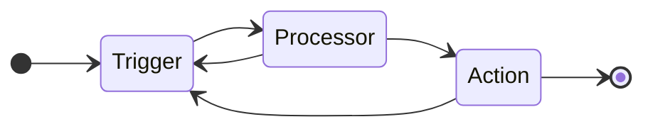

import { CodeOutlined, DiffOutlined, DownloadOutlined, EyeOutlined, PlusOutlined } from "@ant-design/icons";

## Overview

Agents are Windows/Linux background services that can filter and process data, upload files into Ganymede Cloud, initiate data processing pipelines, and deliver data from Ganymede Cloud to instrument PCs.

Starting with version 5.6.0, Ganymede introduces the **Gateway** architecture, which simplifies deployment and management of Agents across your infrastructure.


&nbsp;

For system requirements, see [Agent Network Config & Prerequisites](../configuration/AgentSystemRequirements).

## Gateway Architecture

The Gateway model allows you to install a single executable per PC that can host multiple Connections. This simplifies deployment and maintenance compared to installing separate executables for each Connection.

### Key Concepts

- **Gateway**: A single executable that you install on a PC. The Gateway manages one or more Connections and handles communication with Ganymede Cloud.
- **Host**: A PC where a Gateway is installed and running. Each Host can run multiple Connections.
- **Agent Template**: The code and configuration that defines how a Connection behaves (trigger, processor, and action logic). Agent Templates are created in the Ganymede UI and can be deployed to any Host.
- **Connection**: A running instance of an Agent Template on a Host. Connections perform the actual work of watching directories, processing files, and interacting with Ganymede Cloud.

### Benefits of the Gateway Model

- **Simplified installation**: Install the Gateway executable once per PC, then add Connections through the Ganymede UI without additional installations.
- **Centralized updates**: Core version updates apply to all Connections on a Host simultaneously.
- **Flexible deployment**: Add, remove, or move Connections between Hosts without reinstalling executables.
- **Enhanced monitoring**: The Gateway sends detailed telemetry to track files seen versus files uploaded, enabling advanced monitoring of Connection performance.

### Traditional vs Gateway Architecture

In the traditional model, each Connection requires its own executable to be downloaded and installed on the instrument PC. With the Gateway model, you install the Gateway executable once, and then create Connections on that Host through the Ganymede UI.

| Aspect | Traditional Model | Gateway Model |
|--------|------------------|---------------|
| Installation | One executable per Connection | One Gateway executable per Host |
| Adding Connections | Download and install new executable | Create Connection in UI |
| Core updates | Update each Connection separately | Update Host once |
| Moving Connections | Uninstall and reinstall | Move through UI |

## Migrating from Agents to Gateway

If you have existing Connections running on the traditional Agent model, you can migrate them to the Gateway architecture.

### Migration Steps

1. **Update the Host to version 5.6.0 or higher**, renaming the Host as appropriate
2. **Update an additional Host to version 5.6.0 or higher** (if you want to move Connections between PCs)
3. **Navigate to the page of the Host** where you'd like the Connection to move to
4. **Click Create Connection on Host**. In the **Add Connection** dialog, set **Connection Source** to **Move Existing Connection**, select the Connection in **Connection to Move**, and click **Move Connection**. In the **Confirm Move Connection** dialog, click **Move Connection** again.
5. **Wait until the migration is complete**
6. **Uninstall the old Host** from the PC at your next convenience—it will continue to run without any Connection

:::note

After migration, the original executable can be uninstalled using the standard uninstallation process described in [Uninstalling Agent Connections](./AgentMonitoring#uninstalling-agent-connections).

:::

### Terminology

#### Deployment architecture

- **Gateway**: A single executable installed on a PC that manages one or more Connections and handles communication with Ganymede Cloud. Available in version 5.6.0+.
- **Host**: A PC where a Gateway is installed and running. Hosts are identified by name in the Ganymede UI.
- **Agent Template**: The code and configuration that defines Connection behavior. Agent Templates are created in the Ganymede UI and deployed to Hosts as Connections.
- **Connection**: A running instance of an Agent Template on a Host, actively watching for triggers and processing data.

#### Agent structure

<div class="text--center">

```mermaid
stateDiagram-v2
  direction LR
  [*] --> Trigger
  Trigger --> Processor
  Processor --> Trigger
  Processor --> Action
  Action --> Trigger
  Action --> [*]
```
</div>

- **Agent Template** (or **Agent**): A combination of a trigger, processor, and action configuration to move data from a remote user device into Ganymede.
- **Trigger**: A component configured to initiate the Agent pipeline based on a specific change or event.
- **Processor**: User-defined code that converts data produced by a trigger into a format suitable for the action.
- **Action**: Interaction with Ganymede's cloud or application that moves the processed data to the desired location.
- **Connection**: A running instance of the Agent Template that is or has been connected to Ganymede, waiting for the configured trigger.
- **Pipeline**: A data flow of trigger -> processor -> action, tailored to the use case. Pipelines may share the same trigger and action but differ in the processor template based on the use case.

#### Agent / Connection configuration

- **Runtime Update**: An in-place update to the latest processor and configuration (Agent and Connection levels) without stopping the process. The pipeline loop temporarily pauses to reload files, but no data is lost.
- **Full Update**: A complete update of the Connection binary, useful for incorporating new dependency updates or core-codebase changes. A new Connection executable must be brought up in parallel.
- **Connection Configuration**: Each installed executable maintains its own name, labels, variables, and file tags. This configuration, along with the “parent-level” Agent configuration and processor, makes a Connection unique. Some metadata, like ID, start time, version, and generated metadata, is not configurable.
- **Connection Version**: Updated whenever the Connection configuration is modified. It follows the standard Ganymede version scheme of YYYYMMDD_HHmmSSssss.
- **Agent Configuration**: An Agent's action and trigger can be configured for certain behaviors. The configuration includes user-friendly options like name and file tags.
- **Agent Version**: Updated whenever the Agent configuration changes, following the standard Ganymede version scheme.
- **Core Version**: Refers to the underlying core Agent repo version, which is the foundational code all Agents run on. New features and bug patches increment this version.
- **Connection Variables**: Key-value pairs stored in the Connection configuration, accessible by the user, and used by processor code that depends on certain Connection-level variables.
- **Connection Labels**: Strings used to categorize and identify Connections in the Ganymede UI.
- **Connection Context**: An internal dictionary within the code that is not exposed to the user but allows data to pass between the Agent trigger, processor, and action if necessary.

## Creating an Agent Template

To create a new Agent Template, open **Connectors > Agent Templates** in the left navigation and click the <div className="button system_button"><PlusOutlined /> New Agent Template</div> button.


&nbsp;

Use the **Agent Template Settings** panel on the left to specify the Agent Template's configuration. The right side displays the default Python script for the selected Configuration Type, which you can modify after you create the Agent Template.

<div class="text--center">
  
</div>
&nbsp;

After filling out the form, click <div className="button darkblue_button_icon">Save</div> to create the Agent Template. No executable is built for the Agent Template. Instead, you install the Gateway once on each PC and run the Agent Template on it as a Connection:

1. Click the <div className="button dark_gray_button"><DownloadOutlined /> Download Gateway</div> button, which is available on the **Connections**, **Hosts**, and **Agent Templates** pages, and install the Gateway on the PC. See [Gateway Installation](./AgentInstall#gateway-installation-recommended) for details.
2. Open **Connectors > Hosts** in the left navigation and select the Host.
3. Click <div className="button dark_gray_button"><PlusOutlined /> Create Connection on Host</div>, select **Create from Template**, enter a name for the Connection, select the Agent Template, and click **Create**.

You can also click **Create Connection on Host** on the Agent Template's page and select the Host there.

:::note Legacy Agents

Before version 5.6.0, a Windows and Linux executable was built for each Agent and installed separately for each Connection. If an Agent Template has a legacy build and none of its Connections run on a Gateway, a **Download** button for the legacy executable appears on the Agent Template's page. Executables built before version 5.6.0 are listed on the **Legacy Builds** tab of the Agent Template's page. See [Legacy Installation](./AgentInstall#legacy-installation).

:::

## Configuring Agents

All Agent Templates have two required input parameters, _Agent Template Name_ and _Configuration Type_. Once you select the Configuration Type, input parameters for that type appear.

The _Agent Template Name_ input specifies the display name for the Agent Template.

The _Configuration Type_ input specifies the action performed by the Agent Template, with options including:

- [**Watch for files locally then run flow**](#watch-for-files-locally-then-run-flow): Monitor specified directory on the local file system for files to process and execute upon observing new files matching specified pattern
- [**Set a cron job to run flows periodically**](#set-a-cron-job-to-run-flows-periodically): Periodically observe local directory for files and deliver those files to Ganymede Cloud for processing
- [**Watch for files locally and upload**](#watch-for-files-locally-and-upload): Monitor specified directory on the local file system and upload files to Ganymede Cloud upon observation.
- [**Watch for flow outputs then save locally**](#watch-for-flow-outputs-then-save-locally): Monitor specified flow in Ganymede Cloud Storage for new output files, and capture + process files on local instrument PC upon observation.

  :::note

  To watch for flow _inputs_ instead of flow outputs, set **Watch Bucket** to **Input Bucket** in the Agent Template or in the Connection Settings. For legacy Agents, add the following to the Additional Params input box instead:

  ```bash
  -v "input_bucket=true" 
  ```
  :::

- [**Load local files into Ganymede then run flow**](#load-local-files-into-ganymede-then-run-flow): Load selected local files into Ganymede one time, then run a flow to process them
- [**Load local files into Ganymede**](#load-local-files-into-ganymede): Load selected local files into Ganymede one time
- [**Set a cron job to upload files periodically**](#set-a-cron-job-to-upload-files-periodically): Periodically deliver files to Ganymede Cloud
- [**OPC-UA Subscription**](./OpcUaSubscription): Subscribe to tags on an OPC-UA server and stream readings into a Ganymede table

All configuration types except OPC-UA Subscription also have a `File Tags` input, for tags to apply to every file that the Agent Template's Connections upload, and every configuration type has an `Image` input, for an image to associate with the Agent Template in the Ganymede UI.

:::note Deployment settings

Whether changes to an Agent Template's code and configuration reach running Connections is set on each Host, not on the Agent Template. On the Host's page, under **Deployment Settings**, select **Auto deploy code and configuration changes to Live Connections** or **Require re-installing executables for changes to take effect**, and then click **Save**.

:::

:::tip Conditional execution

The _execute_ function in user-defined code for every Agent type can return `None` to skip execution. This can be useful for conditional execution based on the state of the system or the data being processed.

:::

## Configuration Options

### Reserved variables for all Agents

Reserved variables are used to configure Connection behavior; these can be set [at installation](./AgentInstall#windows-installation-legacy) or in the Connections panel post-installation.  The following reserved variables are available for all Agent types:

- `get_process_metrics`: for Agents v5.5.5+, specifies whether to collect host metrics (CPU, memory, disk) during file processing. Set to "false" to skip this collection if not needed; the default value is "true". 
- `restart_cron_utc`: for Windows Agents v5.5.21+, specifies the UTC time at which the Windows service associated with the Agent will be restarted.  For example, setting this to "0 * * * *" will restart the service every hour on the hour.  This can be helpful for limiting memory usage for frequently executed Agents. Note: restarts will drop the state of captured files, and so generally usage aligns best with cron and file watcher agents with the "ignore_duplicates" toggle set.

#### Reserved variables for Agents that run flows

Agents will retry flows using exponential backoff if they fail.  The following reserved variables are available for Agents that run flows for Agents v5.1.44+:

- `max_flow_retries`: Number of times the Agent will retry running a flow if it fails.  If not specified, the default value is 6.
- `flow_retry_multiplier`: The multiplier for the time that the Agent will wait between flow retries.  If not specified, the default value is 2; this means that each subsequent retry will wait twice as long as the previous one.
- `flow_retry_min_time`: The minimum time (in seconds) that the Agent will wait before retrying a flow.  If not specified, the default value is 2 seconds.
- `flow_retry_max_time`: The maximum time (in seconds) that the Agent will wait before retrying a flow.  If not specified, the default value is 60 seconds.
- `flow_retry_request_timeout`: Number of seconds that the internal request from Agent to Ganymede Cloud to run a flow will wait before timing out.  If not specified, the default value is 30 seconds.

### Watch for files locally then run flow

A Connection watches a directory (and associated subdirectories) for new files and updates to existing files.  The Flow configured with the Agent is triggered when all expected files are found.

#### Input Parameters

- `Flow Name`: The flow to run upon observing new files matching the specified pattern.
- `Parameter Mapping`: A [glob pattern](<https://en.wikipedia.org/wiki/Glob_(programming)>) associated with each file input parameter of the selected flow.

  :::note
  
  This option is only available during Agent Template creation. Further configuration updates will occur inside the notebook, not inside the Agent Template configuration.

  :::

- `If a discovered filename exists in storage`: Specifies what to do when a file with the same name already exists in Ganymede storage: **Use existing cloud version**, **Upload new file with unique filename**, or **Ignore duplicate files**. See [Duplicate file handling](#duplicate-file-handling).
- `Ignore Patterns`: Patterns for files and directories that Connections skip. You can also set Ignore Patterns on each Connection; see [Reserved variables for File Watcher Agents](#reserved-variables-for-file-watcher-agents).
- `De-duplication behavior`: When **Skip files with matching content (MD5)** is selected, files whose content is identical to a previously uploaded file are skipped. Clear it if files with the same content but different filenames (for example, renamed files) must each be uploaded and processed. Requires Gateway v5.6.23 or later. See [Duplicate file handling](#duplicate-file-handling).
- `Sync files on connection start`: When enabled, the Connection scans the watched directory at startup and uploads any files that were created or modified while the gateway was offline. Requires Gateway v5.6.23 or later. See [Sync files on connection start](#sync-files-on-connection-start) for details.
- `Uploaded Files Bucket`: The bucket that Connections upload files to. This input appears only when an S3 bucket has been added to the environment; see [Agent Upload to S3 Bucket](../configuration/AgentToS3BucketConfig).
- `File Tags`: Tags to associate with the files uploaded to Ganymede Cloud.
- `Image`: An image to associate with the Agent Template in the Ganymede UI.

#### Duplicate file handling

Connections that watch for files check each file against the files already uploaded to Ganymede. For Agents v5.5.24 and later, a Connection always skips a file when a previously uploaded file has both the same file name and the same MD5 hash. Two settings control how the Connection handles other duplicates:

- `If a discovered filename exists in storage` (`duplicate_handling`): Specifies what to do when a file with the same name but different content already exists in Ganymede storage.
  - **Use existing cloud version** (`use_existing_file`): Don't upload the file, and use the version already in storage.
  - **Upload new file with unique filename** (`create_new_version`): Upload the file under a unique filename. This is the default for new Agent Templates.
  - **Ignore duplicate files** (`ignore_duplicate`): Skip the file. For Agent Templates that run flows, no flow run is triggered for the skipped file.
- `De-duplication behavior` (`deduplicate_by_md5`): When **Skip files with matching content (MD5)** is selected, the Connection also skips any file whose MD5 hash matches a previously uploaded file, even if the file name is different. This setting is off by default, and Connections migrated from legacy Agents start with it off. It requires Gateway v5.6.23 or later. If any of the Agent Template's Connections run an older Gateway, the form shows a warning that the setting won't take effect until the Gateway is updated.

#### Sync files on connection start

The "Sync files on connection start" toggle (available in the file watcher trigger options) protects against missed files when the Connection is not running — for example after a host reboot, a network outage, or a Connection update. When enabled, each time the Connection starts it performs a one-time reconciliation scan of the watched directory in addition to the live filesystem watcher.

The scan runs in a background daemon thread that starts **after** the live watcher is up, so newly created files are never delayed by the scan. For each Connection with the toggle enabled, the gateway:

1. Fetches the set of MD5 hashes already recorded for the Connection from Ganymede (paginated, 1,000 records per page).
2. Walks the watched directory recursively, applying the same filters as the live watcher: `ignore_hidden_files`, `ignore_hidden_directories`, `ignore_list`, and the file watcher's configured glob patterns.
3. Skips any file whose modification time is newer than `stable_time` seconds in the past — those will be picked up by the live watcher once they stabilize.
4. For each remaining candidate, computes the local file's MD5 and skips it if the hash is already in the known set. Files with an unrecognized MD5 are enqueued through the same `add_file()` path used by the live watcher, so the configured `duplicate_handling` policy (see [Duplicate file handling](#duplicate-file-handling)) applies as a second safety net.
5. Throttles uploads to roughly two per second to avoid overwhelming the API server.

Files modified while the gateway is running are always handled by the live watcher; the startup scan only covers files that changed while the Connection was offline.

This feature is independent of `deduplicate_by_md5` (which deduplicates uploads against Ganymede Storage during normal operation) — the startup scan always uses MD5 to decide what is "new", regardless of that setting.

#### Reserved variables for File Watcher Agents

For Connections that run on a Gateway (version 5.6.0 and later), the following settings are dedicated fields in the Connection's **Connection Settings** rather than variables. To change them, open the Connection, click **Edit Connection**, update the fields, and click **Save**.

| Gateway Connection Settings field | Legacy variable | Description |
|-----------------------------------|-----------------|-------------|
| `Input Path` | `input_path` | The directory to watch. Required. |
| `Ignore Patterns` | `ignore_list` | Patterns for files and directories to skip. |
| `Stable Time (seconds)` | `stable_time` | The number of seconds a file has to be unmodified before the file watcher marks it as observed. This is useful for files that are being written to when you only want to capture the final version of the file. |
| `Stream Contents` | `stream_contents` | If enabled, the file watcher streams the contents of the file to the cloud as it is being written. If disabled, the file watcher waits until the file is closed before uploading it. |
| `Ignore Hidden Files` | `ignore_hidden_files` | If enabled, the file watcher ignores files that the operating system considers hidden. |
| `Ignore Hidden Directories` | `ignore_hidden_directories` | If enabled, the file watcher ignores files inside directories that the operating system considers hidden. |

When you migrate a legacy Connection to a Gateway, these variables are converted to the corresponding fields.

:::note Watched directory availability

If the watched directory (`Input Path` or `input_path`) is deleted or becomes inaccessible, the file watcher restarts automatically (Agents v5.5.29 and later). If a watched network share stops responding, the Connection reports the path as unhealthy and resumes on its own once the share responds again (Gateway v5.6.78 and later).

:::

For legacy Agents (prior to version 5.6.0), reserved variables are used to configure Connection behavior.  These can be set [at installation](./AgentInstall#windows-installation-legacy) or in the Connections panel post-installation. On Gateway Connections, use the Connection Settings fields in the table above instead of the corresponding variables.

- `input_path`: specifies the directory to watch. On Gateway Connections, use **Input Path**.
- `check_interval`: for Agents v5.1.28+, specifies frequency (in seconds) with which a Connection will poll the local directory for new, stable files.  If left blank, the default value is 5 seconds.
- `stable_time`: for Agents v5.1.28+, specifies the time (in seconds) that a file must remain unchanged before being considered stable.  If left blank, the default value is 5 seconds. On Gateway Connections, use **Stable Time (seconds)**.
- `ignore_hidden_files`: for Agents v5.4.61+, specifies that hidden files should be ignored if set to "true".  If left blank, the default value is "false". On Gateway Connections, use **Ignore Hidden Files**.
- `ignore_hidden_directories`: for Agents v5.4.68+, specifies that files in hidden directories should be ignored if set to "true".  If left blank, the default value is "false". On Gateway Connections, use **Ignore Hidden Directories**.
- `ignore_list`: A comma-separated list of patterns that tell the Agent which files/directories to skip watching entirely (events will not hit the agent logs or processor code). Useful for ignoring large volumes of events from backup, log, or other oft-modified but irrelevant files. On Gateway Connections, use **Ignore Patterns**.
  - NOTE: These patterns use a simplified "glob" syntax where the double asterisk `**` can only appear at the start of a pattern. For example, `**/*.txt` is valid (matches text files in any directory), but `backup/**/*.txt` is not valid (`**` is not at the left). To match files in subdirectories, use single asterisks `*`. You'll need multiple patterns, one for each directory level - e.g. `**/backup/*.txt` AND `**/backup/*/*.txt` for files one level deeper, and so on for each additional subdirectory level (since right `**` doesn't work). Full pattern syntax details are in the [Python `pathlib` documentation](https://docs.python.org/3/library/pathlib.html#pathlib.PurePath.match).
- `stream_contents`: for Agents v5.4.66+, specifies whether to deliver the file contents at the time of upload (by execute function), rather than file contents captured by get_param_mapping.  This can be useful for improving memory efficiency of Agents watching for groups of files if set to True.  By default, this is set to false. On Gateway Connections, use **Stream Contents**, which streams the file contents to the cloud while the file is being written, as described in the table above.
- `max_concurrent_workers`: for Agents v5.4.79+, specifies the maximum number of concurrent workers used to process files.  By default, this is set to 10.  The true number of maximum concurrent workers is the minimum of this value, 4 * number of CPU cores, and 64.
- `allow_overlapping_runs`: for Agents v5.4.79+, specifies whether file processing (file upload / Flow run) can overlap with the next file processing.  By default, this is set to true; if set to false, the Agent will wait for the current file processing to complete before starting the next file processing.

#### User-Defined Code

The user-defined code will be generated to map those file patterns to parameters.  Three functions may require modification during configuration:

- `get_param_mapping`: This function is called whenever a file is added or modified in the watch directory.  Modify this function to specify the files you want to look for prior to triggering a flow.
- `execute`: Called when all glob patterns specified by `get_param_mapping` have been matched, this object returned by this function specifies the inputs to the flow that is executed when all files are observed.
- `fp`: This function returns a function that performs pattern matching against a file path.  Use this function as a template for matching files.

For example, if the instrument outputs a CSV file called "\{id\}\_lc_output\<YYYYMMDD\>.csv" that is to be ingested by a [CSV_Read node](../../nodes/File/CSV_Read.md) called "Ingest_Data", an appropriate configuration would be "\{id\}\_lc_output\*.csv" for the input box associated with the "Ingest_Data.csv" node.  The corresponding user-defined code would be:

```python
from agent_sdk import TriggerFlowParams, FileWatcherResult
import re
from typing import Dict, Callable
import glob
import os


def fp(watch_dir: str, parent_dir: str, pattern: str) -> Callable[[str], bool]:
    """
    This function returns a function that performs pattern matching against a file path.
    Use this function as a template for creating your own pattern matching functions, which
    you can then use in the values of the return object in the get_param_mapping function.

    Returns
    -------
    Callable[[str], bool]
        Function that takes a file as input and returns True if the file matches the pattern.
    """

    def fp_res(x: str):
        return x in glob.glob(os.path.join(watch_dir, pattern), recursive=True)

    return fp_res


def get_param_mapping(
    watch_dir: str,
    parent_dir: str = "",
    file_name: str = "",
    modified_time: str = "",
    body: bytes = bytes(),
) -> Dict[str, Callable[[str], bool]]:
    """
    This function is called when a file is added or modified in the watch directory.
    Modify this function to capture the files you want to trigger the flow;
    the function should return a dictionary where the keys are <node name>.<param name>
    and values are functions for performing pattern matching against the target file.

    For nodes that accept multiple inputs, specify a list of functions to match against;
    each specified function should uniquely match 1 file.
    """
    id_group = re.search(r"^(\w+)", file_name)
    if id_group == None:
        return {}
    id = id_group.group()
    return {
        "Ingest_Data.csv": fp(watch_dir, parent_dir, f"{id}_lc_output*.csv"),
    }


def execute(flow_params_fw: FileWatcherResult) -> TriggerFlowParams | None:
    """
    Called when all glob patterns specified by get_param_mapping have been matched.

    Parameters
    ----------
    flow_params_fw : FileWatcherResult
        Dict of FileParam objects indexed by <node name>.<param name>
    
    Returns
    -------
    TriggerFlowParams | None
        Object specifying the inputs to the flow that is executed when all files are observed.  If None is returned, no Flow is triggered.
    """
    return TriggerFlowParams(
        single_file_params=flow_params_fw.files,
        multi_file_params=None,
        benchling_tag=None,
        additional_params={},
    )
```

If a second parameter, such as an [Excel_Read node](../../nodes/File/Excel_Read.md) called "Experiment_Context", is added, the **get_param_mapping** function would be modified to include that parameter:

```python
def get_param_mapping(
    watch_dir: str,
    parent_dir: str = "",
    file_name: str = "",
    modified_time: str = "",
    body: bytes = bytes(),
) -> Dict[str, Callable[[str], bool]]:
    """
    This function is called when a file is added or modified in the watch directory.
    Modify this function to capture the files you want to trigger the flow;
    the function should return a dictionary where the keys are <node name>.<param name>
    and values are functions for performing pattern matching against the target file.

    For nodes that accept multiple inputs, specify a list of functions to match against;
    each specified function should uniquely match 1 file.
    """
    id_group = re.search(r"^(\w+)", file_name)
    if id_group == None:
        return {}
    id = id_group.group()
    return {
        # The keys in the dict below take the form "<node name>.<parameter name>"
        # For example, the default Input_File node is called "Input_File"
        # and has a parameter called "file_pattern", so the key would be
        # "Input_File.file_pattern"
        "Ingest_Data.csv": fp(watch_dir, parent_dir, f"{id}_lc_output*.csv"),
        "Experiment_Context.excel": fp(watch_dir, parent_dir, f"{id}_context.xlsx"),
    }
```

This ensures that files matching the parameters are sent to the correct flow node, and files with the same ID are grouped together. For example, if the following files are ingested:

- experiment626_lc_output072623.csv
- experiment627_context.xlsx
- experiment626_context.xlsx

The flow will only start when all files for experiment627 are ready, preventing the flow from starting prematurely.

Files that match a glob pattern will be uploaded to Ganymede storage, even if they are not used in a flow. Files written to the watched directory can be ignored by ensuring they do not match any of the glob patterns for the parameter inputs.

<div class="text--center">
  
</div>
&nbsp;

Patterns can also be matched against subdirectories using `*` for single level subdirectories and `**` for any level subdirectories.

For example, if your instrument writes out files in a directory like:

```bash
├── experiment_id_1
│   ├── configuration.xml
│   └── results.csv
└── experiment_id_2
    ├── configuration.xml
    └── results.csv
```

You would use parameters like `*/configuration.xml` and `*/results.csv` to upload the files and submit them to a flow.

Documentation on the objects used in the user-defined code and additional examples can be found on the [Agent Templates](./AgentTemplates.mdx#watch-for-files-locally-and-run-flow) page.

#### Example use case

An instrument outputs files to a directory as it completes runs, which are processed in Ganymede Cloud.

### Set a cron job to run flows periodically

A Connection executes a Python script on a set cadence.  Commonly, this Agent type is used as a more flexible version of the Agent type that runs flows upon detecting file change, to allow for greater logic customization in triggering Flows.

Cron Agents can conditionally trigger code, depending on the return value of the execute function; no Flow is triggered if None is returned.

```python
from agent_sdk import FileParam, UploadFileParams


# Required Function
def execute(**kwargs) -> UploadFileParams | None:
    """
    Executes on specified cadence.

    Returns
    -------
    UploadFileParams | None
        Files to upload; if set to None, then no files will be uploaded.
    """

    filename = "changeme.txt"
    body = bytes("Hello, World!", "utf-8")

    new_file_param = FileParam(filename=filename, body=body)

    return UploadFileParams(files=[new_file_param])
```

Additional examples can be found on the [Agent Templates page](./AgentTemplates.mdx#cron-agent)

#### Input Parameters

- `Flow Name`: Flow to run on the configured schedule
- `Cron Expression`: Frequency and times with which to run the flow, based on UTC time
- `Uploaded Files Bucket`: The bucket that Connections upload files to. This input appears only when an S3 bucket has been added to the environment, and you can also set it on each Connection.
- `File Tags`: Tags to associate with the files uploaded to Ganymede Cloud
- `Image`: An image to associate with the Agent Template in the Ganymede UI.

<div class="text--center">
  
</div>
&nbsp;

#### Reserved variables for cron Agents

Reserved variables are used to configure Connection behavior.  These can be set [at installation](./AgentInstall#windows-installation-legacy) or in the Connections panel post-installation.

- `max_concurrent_workers`: for Agents v5.4.78+, specifies the maximum number of concurrent workers used to process files.  By default, this is set to 10.  The true number of maximum concurrent workers is the minimum of this value, 4 * number of CPU cores, and 64.
- `allow_overlapping_runs`: for Agents v5.4.78+, specifies whether file processing (file upload / Flow run) can overlap with the next file processing.  By default, this is set to true; if set to false, the Agent will wait for the current file processing to complete before starting the next file processing.

#### Example use case

A user-defined script runs once a day to poll and capture updates from telemetry devices, which are then processed in a Ganymede flow.

### Watch for files locally and upload

A Connection that monitors a local directory (and associated subdirectories) for new files and file updates, uploading them to Ganymede Cloud when observed.  This type of Agent does not kick off a Flow.

#### Input Parameters

- `File Patterns`: The [glob patterns](<https://en.wikipedia.org/wiki/Glob_(programming)>) that files must match to be uploaded. At least one pattern is required. This option is only available during Agent Template creation.
- `If a discovered filename exists in storage`: Specifies what to do when a file with the same name already exists in Ganymede storage: **Use existing cloud version**, **Upload new file with unique filename**, or **Ignore duplicate files**. See [Duplicate file handling](#duplicate-file-handling).
- `Ignore Patterns`: Patterns for files and directories that Connections skip.
- `De-duplication behavior`: When **Skip files with matching content (MD5)** is selected, files whose content is identical to a previously uploaded file are skipped. Requires Gateway v5.6.23 or later. See [Duplicate file handling](#duplicate-file-handling).
- `Sync files on connection start`: When enabled, the Connection scans the watched directory at startup and uploads any files that were created or modified while the gateway was offline. Requires Gateway v5.6.23 or later. See [Sync files on connection start](#sync-files-on-connection-start) for details.
- `Uploaded Files Bucket`: The bucket that Connections upload files to. This input appears only when an S3 bucket has been added to the environment.
- `File Tags`: Tags to associate with the files uploaded to Ganymede Cloud.
- `Image`: An image to associate with the Agent Template in the Ganymede UI.

The [Reserved variables for File Watcher Agents](#reserved-variables-for-file-watcher-agents), including the Connection Settings fields for Gateway Connections, also apply to this configuration type.

<div class="text--center">
  
</div>
&nbsp;

#### Example use case

Multiple flow cytometers are used to observe cell populations for a related set of experiments.  Ganymede Connections associated with an Agent are configured to systematically capture these runs.

### Watch for flow outputs then save locally

A Connection that monitors Flow file outputs, saving them to local directories as specified by the Agent logic.

#### Input Parameters

- `Watch Bucket`: The bucket to watch: **Output Bucket** for flow outputs, or **Input Bucket** for flow inputs. You can also set this on each Connection.
- `File Patterns`: The [glob patterns](<https://en.wikipedia.org/wiki/Glob_(programming)>) that files must match in order to be downloaded.
- `Flow Name`: The flow from which to download files. If `File Patterns` is empty, selecting a flow fills it with a pattern that matches only that flow's files.
- `Image`: An image to associate with the Agent Template in the Ganymede UI.

<div class="text--center">
  
</div>
&nbsp;

Additional examples can be found on the [Agent Templates page](./AgentTemplates.mdx#watch-for-flow-outputs-then-save-locally)

#### Reserved Variables for Download Agents

For this configuration, the following reserved variables are available:

- `output_path`: specifies the directory to store files to.

#### Example use case

Instructions for lab execution are generated in Ganymede Cloud and downloaded to the instrument PC for execution.

### Load local files into Ganymede then run flow

A Connection that loads local files into Ganymede one time, then runs a flow to process that data.  The user-defined code selects, filters, and normalizes the data before upload.  This can be useful for conducting data backfills that also need processing.

#### Input Parameters

- `Flow Name`: The flow to run on the loaded files.
- `File Tags`: Tags to associate with the files uploaded to Ganymede Cloud.
- `Image`: An image to associate with the Agent Template in the Ganymede UI.

#### Example use case

Historical instrument output files are loaded into Ganymede and processed by the same flow used for new runs.

### Load local files into Ganymede

A Connection that loads local files into Ganymede one time (as opposed to persistently monitoring a directory for new files and updates).  The user-defined code selects, filters, and normalizes the data before upload.  This can be useful for conducting data backfills.

This configuration type was previously named "Load local files into Ganymede with a custom filter".

#### Input Parameters

- `File Tags`: Tags to associate with the files uploaded to Ganymede Cloud.
- `Image`: An image to associate with the Agent Template in the Ganymede UI.

<div class="text--center">
  
</div>
&nbsp;

#### Example use case

A selected subset of key instrument output files are captured on Ganymede Cloud.

### Set a cron job to upload files periodically

A Connection that uploads files to Ganymede Cloud on a scheduled cadence.

#### Input Parameters

- `Cron Expression`: The frequency and times at which to upload files, based on UTC time.
- `Uploaded Files Bucket`: The bucket that Connections upload files to. This input appears only when an S3 bucket has been added to the environment, and you can also set it on each Connection.
- `File Tags`: Tags to associate with the files uploaded to Ganymede Cloud
- `Image`: An image to associate with the Agent Template in the Ganymede UI.

<div class="text--center">
  
</div>
&nbsp;

#### Example use case

A local file is modified at regular intervals and needs to uploaded to Ganymede Cloud after each modification.

### OPC-UA Subscription

A Connection that subscribes to tags (monitored items) on an OPC-UA server, such as a bioreactor or fermentation vessel control system, and streams live readings into a Ganymede data table as values change on the server. No processor code, files, or flows are involved.

See [OPC-UA Subscription Agents](./OpcUaSubscription) for setup, endpoint and security settings, monitored items, the destination table, and troubleshooting.

## Variables and Labels in Windows Agent Connections

For legacy Agents (prior to version 5.6.0) that reference local directories, the monitored directory is specified in the Additional Params input box.  All subdirectories of _input_path_ are also monitored.  For Gateway Connections, set the monitored directory in the **Input Path** field of the Connection Settings instead.

```shell
-v "input_path=/absolute/path"

# Example Windows input path specification
# -v "input_path=C:\Users\<username>\Desktop\watch_folder"

# If the directory is in a network drive, be sure to use the UNC path or IP like so:
-v "input_path=//server/share/path"
# where `server` is the name of the server and `share` is the name of the shared folder

# When using administrative shares, the path should be specified with the $ symbol at the end of the drive letter:
-v "input_path=\\computername\d$\path\to\folder"

```

More generally, Variables and Labels can be flexibly used to control Connection behavior.  Additional Variables and Labels can be defined as show in the example below:

```shell
# Example: multiple variables and labels passed in
-v "abc=1" -v "xyz=2" -l "UPLC" -l "Analytical Dev"
```

And [modified in the corresponding Connections panel in the Ganymede web app after installation, for Agent versions 4.5+](AgentMonitoring#maintaining-agent-connections).

Variables and labels can be referenced in your user-defined code by extracting the values from `kwargs` in the _execute_ function.

```python
# Labels comes back as a list of strings
labels = kwargs.get('labels', [])

# All variables retrieved have a dict[str, str] type
variables = kwargs.get('vars', {})

# Example: Retrieve the `input_path` variable for use in Agent code
input_path = kwargs.get('vars', {})['input_path']

# Example: Retrieve all labels for use in Agent code
connection_labels = kwargs.get('labels', [])
```

:::info Sleep status

Agents may be unable to run if the computer enters a sleep state; this is particularly relevant for cron flows. To prevent this, ensure that the computer is not set to sleep when the flow is expected to execute.

:::

:::note Network privileges

Windows services use the Local System User, which does not have network privileges by default. You may need to ensure the service runs on a user account that can access the network drive.

To do so, follow the steps below:

1. **Set Up Authentication**:
    - Use Windows Credential Manager to store the remote user's credentials on the local system.
    - Or, create matching local (if cross-domain) or domain (if on the same domain, e.g. AD) user accounts on both the remote and local systems.
2. **Check Network**:
   - Ensure both systems can communicate as described on the [Agent Network Config page](../configuration/AgentSystemRequirements)
3. **Service Configuration**:
   - Open `services.msc` on the local system.
   - Find and right-click the Ganymede service > `Properties` > `Log On`. Use the local user account where the credentials are stored (not the "Local System Account").
4. **Restart Service**:
   - In `Services`, right-click the service and select `Restart`.

**Note**: Use IP if systems are on different domains.

:::

## Configuring User-Defined Python

To view or modify the user-defined code that an Agent Template runs, open **Connectors > Agent Templates** in the left navigation and select the Agent Template. The **Code** actions are in the page header:

- <div className="button gray_button"><EyeOutlined /> View</div> opens the code in a read-only viewer, where you can copy it.
- <div className="button gray_button"><CodeOutlined /> Edit</div> opens a notebook in a new browser tab, where you can modify the code executed on observed files before transfer. **Edit** is unavailable if you don't have permission to modify the Agent Template or the Agent Template is disabled or archived, and it isn't shown in environments with [GxP Validation Mode](../admin/GxPValidation#gxp-validation-mode) enabled.

For legacy Agent Templates, the header can also show a **Download** button for the legacy executable; see [Legacy Agents](#creating-an-agent-template).

<div class="text--center">
  
</div>
&nbsp;

<div class="text--center">
  
</div>
&nbsp;

Agent executables built before version 5.6.0 remain available for download on the **Legacy Builds** tab of the Agent Template's page. See [Viewing Build History (Legacy)](./AgentMonitoring#viewing-build-history-legacy).

### Processor SDK

User-defined code imports objects such as `FileParam`, `TriggerFlowParams`, and `UploadFileParams` from `agent_sdk` (Agents v5.0 and later; earlier Agents used `ganymede_sdk.agent`). See the [Agent SDK](../../sdk/markdowns/AgentSDK) reference.

On Gateway v5.6.21 and later, processor code can also read the tags configured on the Connection and on the Agent Template. Pass the `kwargs` that _execute_ receives to `get_sdk` from `gateway.processor_sdk`, and then call `get_connection_tags()` or `get_agent_tags()`. Each tag has a `tag_type_id` and a `display_value`.

```python
from agent_sdk import FileParam, UploadFileParams
from gateway.processor_sdk import get_sdk

def execute(**kwargs) -> UploadFileParams | None:
    sdk = get_sdk(kwargs)

    connection_tags = sdk.get_connection_tags()
    agent_tags = sdk.get_agent_tags()
    sdk.info(f"Connection tags: {[(t.tag_type_id, t.display_value) for t in connection_tags]}")
    sdk.info(f"Agent tags: {[(t.tag_type_id, t.display_value) for t in agent_tags]}")

    # ... rest of processor code
```

